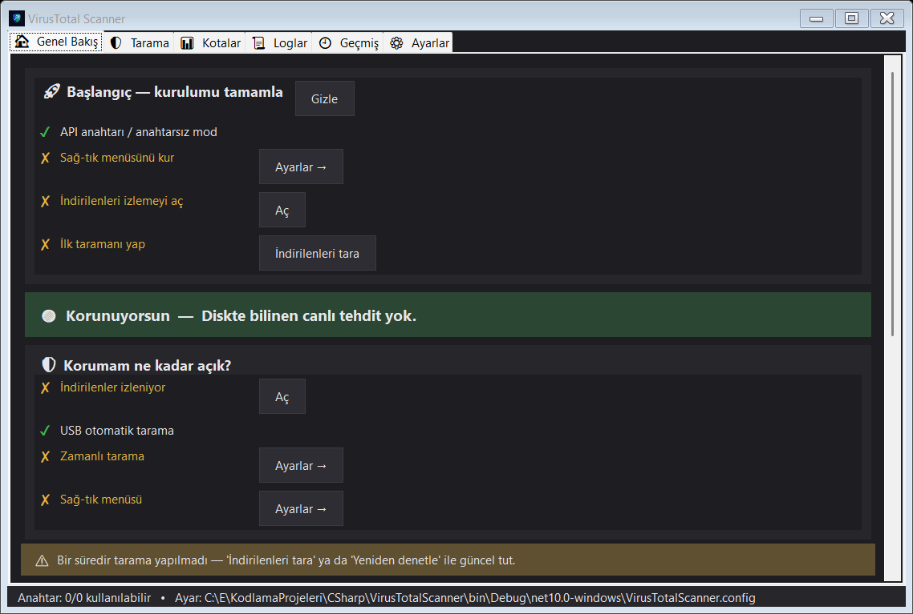
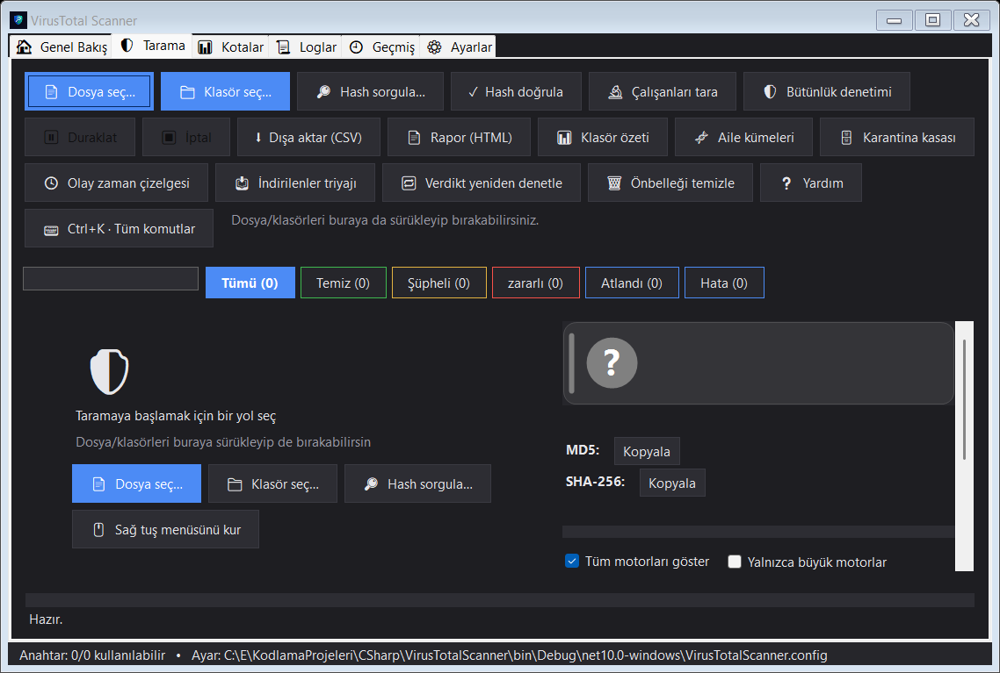

# VirusTotal Scanner

A single‑exe Windows app (WinForms, **.NET 10**) that scans files, folders, or running processes against
**VirusTotal**. Right‑click a file in Explorer, drag‑and‑drop onto the window, paste a hash, or drive it
from the terminal. No installer — one self‑contained `.exe`, with all of its state in one folder beside it.





## Why

VirusTotal's website is great for one file at a time. This app is for the rest: checking a whole Downloads
folder, every running process, or a freshly built binary before you trust it — fast, in bulk, and without
leaving your desktop. It caches results to save quota, skips files that are already trusted, and keeps a
searchable history so you can answer "did this turn malicious since I last checked?".

## Run modes (one exe)

- **Double‑click / no args** → full GUI.
- **File/folder argument** (right‑click menu, or drag‑drop onto the exe) → scans in the GUI; if an instance
  is already running, the paths are handed to it (one shared queue).
- **From a terminal** → command‑line mode (no GUI; output goes to the console and an exit code is returned).

## Getting started

1. Download `VirusTotalScanner.exe` from the [latest release](https://github.com/muhammetozeski/VirusTotalScanner/releases/latest)
   and run it. It is self‑contained — nothing else to install (WebView2 Runtime, bundled with Windows 11, is
   only needed for the optional keyless mode).
2. On first run a short wizard lets you add a VirusTotal API key and, optionally, the right‑click menu.
3. **Settings → "Add to right‑click menu"** registers a *Scan with VirusTotal* entry for files and folders.

## Features

**Scanning & queue**
- Existence check by hash first; if VirusTotal has never seen the file, it uploads with a live progress bar
  and waits for analysis.
- Verdict‑aware queue with live search and filter chips (Clean / Suspicious / Malicious / Skipped / Error),
  a segmented overall‑progress bar, pause/resume/cancel, and keyboard jumps between threats.
- Scan running processes ("am I infected right now?"), expand archives and scan their members, or look up a
  bare MD5/SHA‑1/SHA‑256.

**Every list is the same** — the queue, the quarantine vault, scan history, downloads triage, the per‑engine
detail table, and every dialog share one central list component: real multi‑select with a leading checkbox
column, right‑click that selects the row first, "mark/unmark selected", and a copy menu for each row's file
path, name, SHA‑256, MD5, and VirusTotal link.

**Detail pane** — per‑engine results table (major engines starred, stale signatures flagged), detection‑ratio
bar, a plain‑language recommendation, hashes with one‑click copy, an optional behaviour digest (network /
files / registry / MITRE), and community comments — the whole pane scrolls as one.

**After the verdict**
- **Quarantine vault** — reversible; restoring re‑checks the current verdict so clearing a false positive is
  safe, not blind. Handles files locked by a running process and can neutralize at reboot.
- **Scan history** — searchable, star/notes, "did this later turn malicious?" re‑verdict, recurring‑threat and
  threat‑hotspot views, HTML report export.
- **Downloads triage** — recent downloads with origin host, signature, cached verdict, and same‑source
  clustering.
- **Incident timeline** — which executables landed on disk, grouped by day.
- **Integrity baseline** — pin files and detect drift later.
- Family clusters, per‑folder rollup, folder neighbors, persistence‑hook hunting, copy finder.

**Keys & quota**
- Multiple API keys with rotation (switches when one is exhausted; counts down and auto‑resumes when all are);
  per‑key minute (4) / daily (500) / monthly (15.5K) quota tracking on a live dashboard.
- Keys are encrypted with DPAPI and stored in the settings file.
- Resilient HTTP (Polly retry/backoff; key rotation on HTTP 429).

Dark/light theme, system tray with threat notifications, CSV/HTML export, live log viewer.

## Keyless / quota‑free checking

VirusTotal's API charges every hash lookup against your quota. Two genuinely keyless paths exist:

1. **Local signature pre‑filter.** Validly signed files (embedded *or* catalog‑signed — e.g. all Windows
   files) are verified with `WinVerifyTrust` and **never sent to VirusTotal** — no key, no quota. They are
   marked *Signed (not scanned)*; a signature means the publisher is verified, **not** that the file is clean.
   By default only Microsoft‑signed files are skipped; add publishers, "all valid signatures", or a
   known‑good hash list under **Settings → Trust sources**. Force a scan with right‑click → *Ignore trust,
   scan with VT*.
2. **Keyless GUI lookup (WebView2).** **Settings → Trust sources → "Keyless lookup"** (or CLI `--keyless`).
   A hidden browser opens VirusTotal's public page and captures the page's own data response — no key, no
   quota, but **slow**, and lookup‑only (it cannot upload an unknown file).

## Command line

```
VirusTotalScanner.exe [options] <file|folder> [<file|folder> ...]
  -n, --cli, --nogui     run in the terminal without a GUI
  -r, --recurse          scan folders recursively
      --no-trust         ignore signature trust (send signed files to VT too)
  -k, --keyless          keyless lookup via the WebView2 GUI (no quota, slow)
      --expand-archives  expand archives (zip/jar/nupkg…) and scan their members
      --running          scan the on‑disk image of every running process
  -j, --json             machine‑readable JSON to stdout
  -q, --quiet            terse output (verdict lines only)
      --report <path>    write a report (.html/.csv/.json/.txt — format from the extension)
      --fail-on <N>      exit 1 if any file has N+ detections (CI gate)
      --diff <json>      compare against a prior --report json (by sha256); print the delta
      --fail-on-new / --fail-on-regression   exit 1 on new / worsened verdicts
      --lookup <hash>    look up an MD5/SHA‑1/SHA‑256 hash
      --expect <hash>    verify a file against an expected hash (exit 4 on mismatch)
      --install / --uninstall / --repair     right‑click menu (HKLM, needs admin/UAC)
      --addkey <KEY> / --listkeys / --removekey <id|all>
  -g, --gui              force the GUI even from a terminal
  -h, --help   -v, --version
```

**Exit codes:** `0` clean · `1` threat found · `2` usage/IO error · `3` no API key · `4` hash mismatch.

Because this is a GUI app, wait for it in a script with `Start-Process -Wait VirusTotalScanner.exe ...`.

## Building & releasing

```powershell
dotnet build      # build
dotnet run        # launch the GUI
```

Releases are a single‑file, self‑contained, ReadyToRun exe (trimming stays **off** — the reflection‑based
localization breaks under trimming). The exact publish/deploy steps are in
[`docs/guncelleme.md`](docs/guncelleme.md).

Runtime data (logs, cache, history, quarantine) lives next to the exe (or under
`%AppData%\VirusTotalScanner\` when that folder isn't writable). The version is set by `<Version>` in the
`.csproj`.
